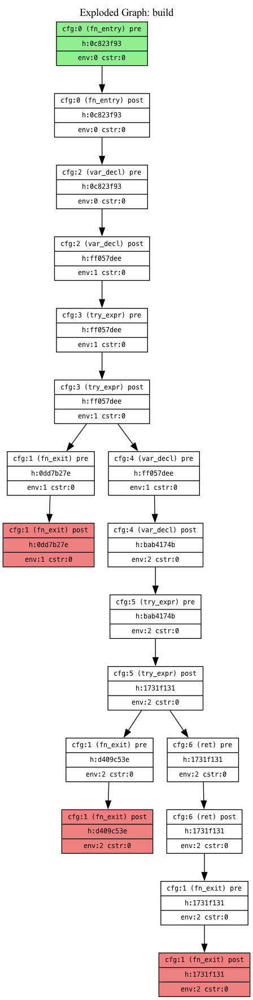
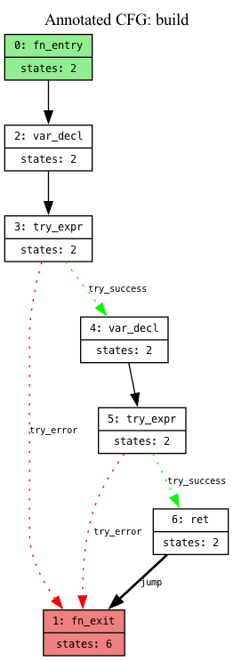
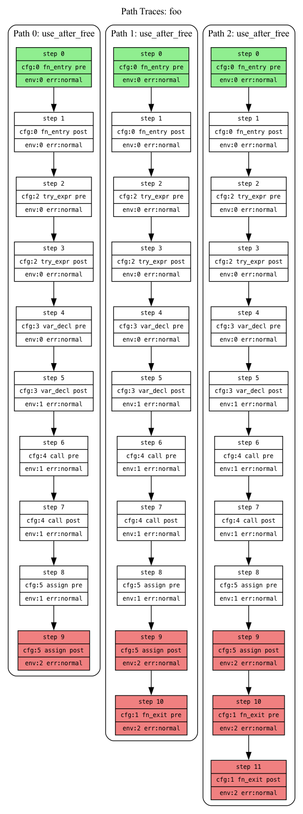

# Visualization

Zwanzig provides visualization tools for debugging the static analysis engine. All visualizations output DOT files compatible with [Graphviz](https://graphviz.org/).

## Viewing DOT files

```bash
# Convert DOT to PNG with Graphviz
dot -Tpng ./output/myfile_functionName.dot -o output.png

# Or use online viewers:
# - https://edotor.net
# - https://viz-js.com
```

## CFG visualization

**Flag:** `--dump-cfg <dir>`

Dumps control flow graphs showing the structure of each function.

```bash
zwanzig --dump-cfg ./cfg_output src/myfile.zig
```

### Node styling
- Entry nodes (`fn_entry`): Green background
- Exit nodes (`fn_exit`): Red background
- Branch/loop headers: Diamond shape

### Edge colors
| Color | Edge Types |
|-------|-----------|
| Green | `branch_true`, `try_success`, `catch_success` |
| Red | `branch_false`, `try_error`, `catch_error`, `errdefer_edge` |
| Blue dashed | `loop_back` |
| Orange | `loop_exit` |
| Purple dashed | `defer_edge` |

### Programmatic access
The `Cfg` struct provides `dumpDot(allocator)` for quick stderr output.

## Lattice flow visualization

Engine-based checkers build exploded graphs showing all reachable (CFG node, state) pairs. Three visualization options are available.

> These visualizations only show data from engine-based checkers (`store-violations-engine`, `empty-catch-engine`, `swallowed-error`, `optional-unwrap`, `divide-by-zero-engine`). AST-based rules won't appear in path traces.

### Exploded graph

**Flag:** `--dump-exploded-graph <dir>`

Shows the full state space explored. Each node represents a unique (CFG location, abstract state) pair.

```bash
zwanzig --dump-exploded-graph ./eg_output src/myfile.zig
```

**Node information:** CFG index and IR tag, pre/post state indicator, state hash, environment size, constraint count.

**Node colors:** Green (entry states), Red (exit states), Yellow (states with violations).

**Use cases:** Understanding state explosion, debugging convergence issues, visualizing path sensitivity.

#### Example

Source file (`test/fixtures/store_violations_engine/arraylist_append_ok.zig`):
```zig
const std = @import("std");

fn build(allocator: std.mem.Allocator) !std.ArrayList([]u8) {
    var list: std.ArrayList([]u8) = .empty;
    const item = try allocator.alloc(u8, 1);
    try list.append(allocator, item);
    return list;
}
```

Generated exploded graph:



### Annotated CFG

**Flag:** `--dump-annotated-cfg <dir>`

Overlays state information onto the CFG structure, showing how many unique states reached each CFG node.

```bash
zwanzig --dump-annotated-cfg ./acfg_output src/myfile.zig
```

**Node information:** CFG index and IR tag, count of unique states that reached this node.

**Node colors:** Green (entry), Red (exit), Yellow (violation detected).

**Use cases:** Identifying hot spots with many states, quick overview without full state explosion detail, locating violation points.

#### Example

Source file (`test/fixtures/store_violations_engine/arraylist_append_ok.zig`):
```zig
const std = @import("std");

fn build(allocator: std.mem.Allocator) !std.ArrayList([]u8) {
    var list: std.ArrayList([]u8) = .empty;
    const item = try allocator.alloc(u8, 1);
    try list.append(allocator, item);
    return list;
}
```

Generated annotated CFG:



### Path traces

**Flag:** `--dump-path-trace <dir>`

Shows execution paths from function entry to each detected violation.

```bash
zwanzig --dump-path-trace ./traces src/myfile.zig
```

**Output structure:** One subgraph per violation, labeled with violation type.

**Node information:** Step number, CFG index and IR tag, pre/post state, environment size, error state.

**Node colors:** Green (entry point), Red (violation location), White (intermediate steps).

**Use cases:** Understanding root cause of violations, debugging false positives, tracing error propagation paths.

#### Example

Source file (`test/fixtures/store_violations_engine/use_after_free.zig`):
```zig
const std = @import("std");

fn foo(allocator: std.mem.Allocator) !void {
    var ptr = try allocator.alloc(u8, 1);
    allocator.free(ptr);
    _ = ptr;  // use after free!
}
```

Generated path trace showing the path to the `use_after_free` violation:



## Output file naming

All visualization files follow the naming convention:

```
<source_basename>_<function_name>_<suffix>.dot
```

Where `<suffix>` is:
- CFG: `<ast_node_index>` (e.g., `myfile_foo_42.dot`)
- Exploded graph: `exploded` (e.g., `myfile_foo_exploded.dot`)
- Annotated CFG: `annotated` (e.g., `myfile_foo_annotated.dot`)
- Path traces: `traces` (e.g., `myfile_foo_traces.dot`)

## Combining visualizations

Dump multiple visualizations in a single run:

```bash
zwanzig \
  --dump-cfg ./output \
  --dump-exploded-graph ./output \
  --dump-annotated-cfg ./output \
  --dump-path-trace ./output \
  src/myfile.zig
```

## Tips

1. **Start with Annotated CFG** for a quick overview of where states accumulate
2. **Use Path Traces** to understand specific violations
3. **Use Exploded Graph** only when you need full detail—it can be very large for complex functions
4. **Compare CFG and Annotated CFG** to see which paths have more state complexity
